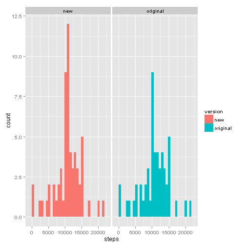
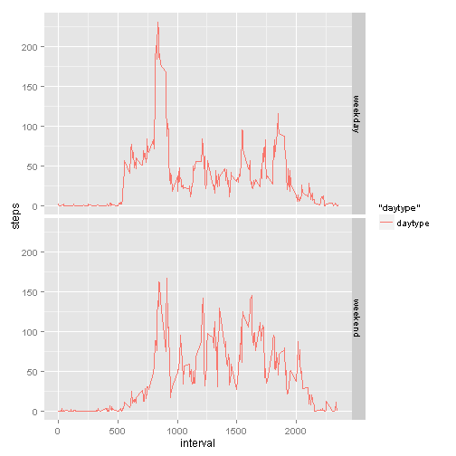

###Preamble
This assignment makes use of data from a personal activity monitoring device. This device collects data at 5 minute intervals through out the day. The data consists of two months of data from an anonymous individual collected during the months of October and November, 2012 and include the number of steps taken in 5 minute intervals each day.

The data for the assignment was downloaded from here :  (https://d396qusza40orc.cloudfront.net/repdata%2Fdata%2Factivity.zip)

The variables the dataset are:

* steps: Number of steps taking in a 5-minute interval (missing values are coded as NA)
* date: The date on which the measurement was taken in YYYY-MM-DD format
* interval: Identifier for the 5-minute interval in which measurement was taken

The rest of the report is structured in sections entitled with the questions from the Coursera "Reproducible Research" Assignment: "Peer Assessment 1" (eg. "What is the mean...etc")
<br />
<br />

###What is mean total number of steps taken per day?

Following code chunk unzips and reads the data from the "activity.csv" file, calculates the sum of steps per day and creates a data frame called "spd" with the information


```r
    df <- read.csv(unz("activity.zip", "activity.csv"), stringsAsFactors = F)
    df[,2] <- as.Date(df[,2], format="%Y-%m-%d")
    spd <- aggregate(steps~date,data=df, sum, na.action=na.omit)
```

A Histogram of total steps taken each day generated as follows and shown below:


```r
hist(spd$steps, breaks=10, col="red", main= "Histogram of Total Steps Taken per Day", xlab="")
```

 

The Mean and Median are then calculated as with following code:


```r
    spd_smry <- summary(spd$steps, digits=5)
    spd_mn <- spd_smry[4]
    spd_md <- spd_smry[3]
```
<br />
<br />

Turning off scientific notation:


```r
    options(scipen=999)
```

Mean of total steps per day is **10766** <br />
<br />
Median of total steps per day is **10765**
<br />
<br />

###What is the average daily activity pattern?

<br />
This code chunk aggregates the average steps taken in each interval across all the days:

```r
    aspi <- aggregate(steps~interval, data=df,mean,na.action=na.omit)
```

The plot is then generated with the interval having the maximum average # of steps indicated.

```r
    plot(x=aspi$interval,y=aspi$steps, main="Average (Mean) of Steps per Interval - Averaged across all Days", type="l", xlab="Intervals", ylab="Average # of Steps")
    row_of_max_steps <- which(aspi$steps==max(aspi$steps))
    imax <- aspi[,1][[row_of_max_steps]]
    abline(h=0,v=imax)
```

 

The interval with the maximum average steps taken is **835**

<br />
<br />

###Imputing missing values

<br />
The method chosen for replacement of missing values uses the mean values (of steps) for each interval to replace missing values for that same interval (i.e. if interval 100 on Oct.1, 2012 and Nov.3 2012 has missing values, the mean value for interval 100 will be used for both).
<br />
First, we find the total number of missing values in the dataset:


```r
    tmv <- sum(is.na(df[,1]))
```

Total missing values is **2304**

We then proceed to identify the location of missing values in the dataset and replace them with the method outlined above:
<br/>

```r
    #Create index of missing values
    mv_pointer <- is.na(df[,1])

    # Get all intervals with missing values
    iwmv <- df$interval[mv_pointer]

    # Create vector with unique intervals with missing values
    uiwmv <- unique(iwmv)

    # Create table with average steps needed (i.e extract table with corresponding steps of interest.  This is the "lookup table")
    asn <- aspi[aspi$interval %in% uiwmv,]

    # Get row numbers with NA's in original data frame
    rnwn <- which(mv_pointer)

    #Copy data frame
    newdf <- df

    # Find matching step values from lookup table and place in appropriate rows in the steps column of copied dataframe
    newdf[rnwn,1] <- round(asn[,2][match(newdf[rnwn,3],asn[,1])],0)
```
<br/>
NB.<br/>
It is worthy of note that the lookup table (asn), and the table of average steps per interval (aspi) are exactly the same. The creation of asn was not superfluous however.  Both tables are the same because all of the intervals just happen to have associated missing values somewhere in the dataframe - thereby resulting in asn replicating the originally computed aspi table.
<br/>
<br/>
Recalculating the total Steps per day with the new dataframe - as well as new values for mean and median :


```r
    newspd <- aggregate(steps~date,data=newdf, sum, na.action=na.omit)
    newspd_smry <- summary(newspd$steps, digits=5)
    newspd_mn <- newspd_smry[4]
    newspd_md <- newspd_smry[3]
```
Plotting histogram of new values alongside the old :


```r
   #Combining old and new datasets & adding "version" column
    newspd$version <- "new"
    spd$version <- "original"
    oan <- as.data.frame(rbind(spd,newspd))

    #Plotting

    library(ggplot2)
    ggplot(oan, aes(x=steps, fill=version)) + geom_histogram()+facet_grid(.~version)
```

 

<br />
<br />
The New Mean of total steps per day is **10766** <br />
<br />
The New Median of total steps per day is **10762**

<br/>
The mean remains the same but the median has shifted slightly.  The distribution of total steps per day remains pretty much the same, with the frequency of the maximum increasing.  This is likely due to the additional 8 days of data which were omitted in the original dataset (where days with all NA's for steps were omitted from the calculations)
<br/>
(Note: The new mean would have equalled the original had we not rounded the number of steps used to replace the NA's in the old dataset)
<br/>

###Are there differences in activity patterns between weekdays and weekends?

<br/>
For this section we now create a new column of class "factor" and name" daytype in the new dataset.
We then re-compute the average (mean) steps taken in each interval across all the days as before:


```r
    # Create new factor colum
    newdf$daytype <- ifelse(weekdays(newdf$date) == "Saturday" |weekdays(newdf$date) == "Sunday", "weekend","weekday")

    newdf$daytype <- as.factor(newdf$daytype)

    #Compute average steps per interval across all days ("newaspi"")
        newaspi <- aggregate(steps~interval +daytype, data=newdf,mean,na.action=na.omit)
```
Creating Panel Line Plot:

```r
    ggplot(newaspi,aes(x=interval,y=steps)) + geom_line(aes(colour="daytype")) +facet_grid(daytype~.)
```

 

The differences between weekdays and weekends are evident from the plots. For example, more walking is done between intervals 500 and 755 on weekdays (i.e.between the hours of 5am and 7:55am - assuming interval 0 occurs at midnight). There is also a lot more walking between 10:00am and 5:00pm on weekends.
